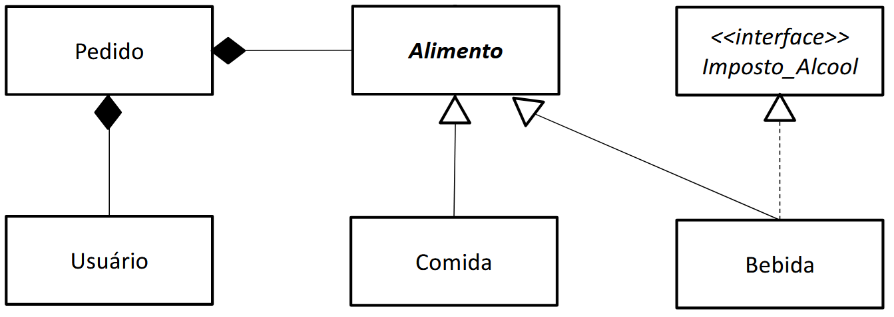

# Projeto FEIFood (CCM310)

Projeto do 3º semestre do curso de Ciência da Computação do Centro Universitário FEI.

## O que é esta aplicação

Este é um aplicativo de interface gráfica implementado em Java e PostgreSQL cujo objetivo é recriar uma versão simplificada da plataforma iFood, onde os usuários podem realizar pedidos de entrega de alimentos.

## Funcionalidades

Este programa tem como funcionalidade:
- O cadastro e login de usuários via nome e senha. O nome serve como um identificador único para cada usuário.
- Busca de alimentos pelo nome. Essa bus é case-insensitive (capitalização não a afeta) e funciona através de uma checagem "startsWith()". Ou seja, ela so irá exibir os alimentos cujo nome começa com a string de busca especificada pelo usuário.
- Lista de alimentos que permite o usuário ver as informações de um alimento através do botão "Detalhes", aumentar sua quantidade no pedido através do botão "+" e diminuir através do botão "-". Checagens de quantidade impedem que a quantidade seja negativa.
- Um único pedido que o usuário pode modificar através dos botões acima.
- Um botão de "Limpar Pedido" que exclui o pedido ao zerar todas as quantidades dos alimentos.
- Um botão de "Confirmar Pedido" que cadastra o pedido e imediatamente o considera como entregue.
- Após um pedido ser entregue, uma caixa de diálogo é exibida pedindo que o usuário avalie a entrega atribuindo de 1 a 5 estrelas.
- Todas as funcionalidades estão acompanhadas de checagem de erros, os quais são apresentados ao usuário na forma de caixas de diálogo.

## Arquivos no Projeto

Este projeto conta com uma pasta FEIFood que contém um projeto do NetBeans. Dentro dessa pasta, é possível encontrar:
- FEIFood/src/feifood/: o código fonte do projeto.
- FEIFood.jar: o arquivo .jar executável deste projeto.
- javadoc.zip: o arquivo de documentação do projeto gerado pelo Javadoc (compactado).

## Diagrama de Classes (UML)

